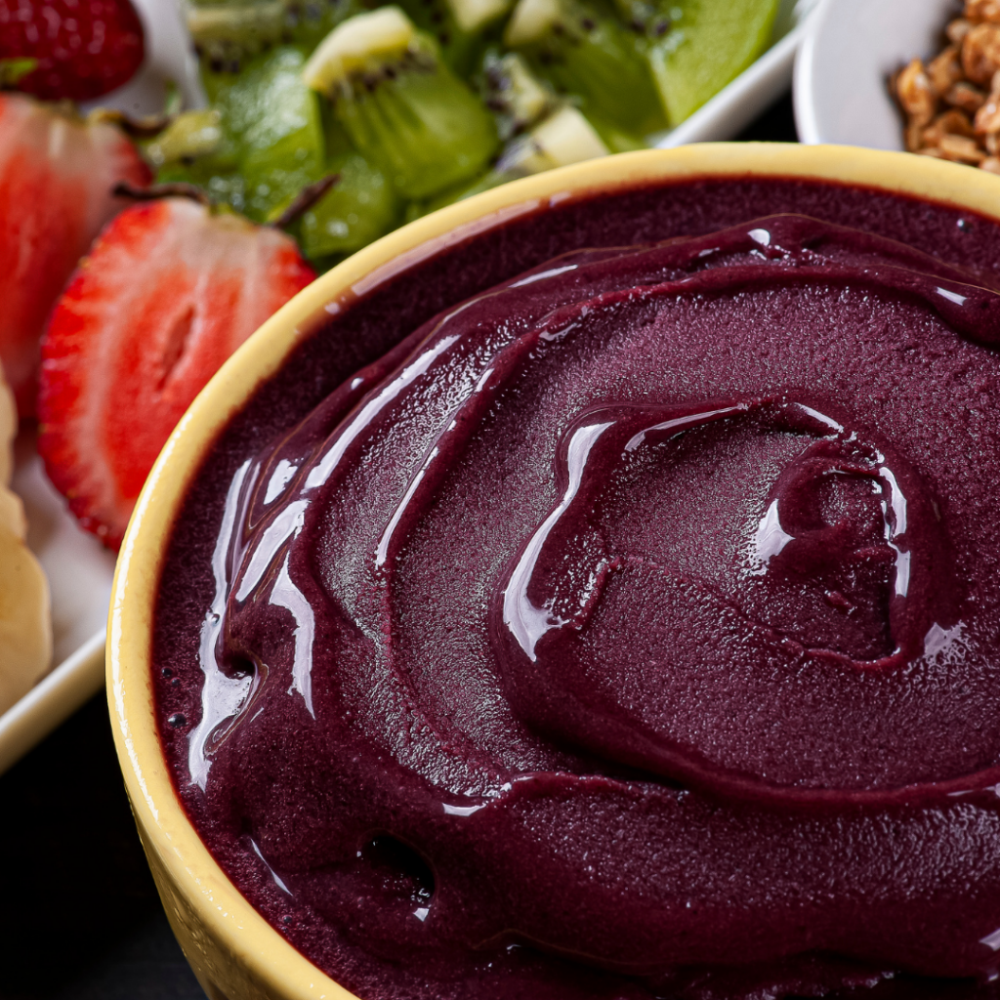

# projetos
<!DOCTYPE html>
<html lang="pt-br">
<head>
    <meta charset="UTF-8">
    <meta http-equiv="X-UA-Compatible" content="IE=edge">
    <meta name="viewport" content="width=device-width, initial-scale=1.0">
    <link rel="stylesheet" href="jeferson-7.github.io/projetos/style.css"/>
    <title>Desafio-1</title>
    <bgcolor="black">
</head>
<body>
    <header> <!-- cabeçalho-->
        <a class="link-menu">HOME</a>
        <a class="link-menu">PRODUTOS</a>
        <a class="link-menu">PEDIDO</a>
        <a class="link-menu">SOBRE NÓS</a>
        <button class="button-sign-up">Log in</button>
    </header>
    <main> <!--a Principal-->
        

        

            <h1> Açaí</h1>
            
O fruto tradicional da região Norte e Nordeste ganhou bastante popularidade em todo o país. Conheça seus principais benefícios e saiba como escolher a polpa feita a partir do alimento.

            <button class="button-div">Saiba mais</button>
             
             
             
             
             
             
        

    </main>

</body>
</html>
